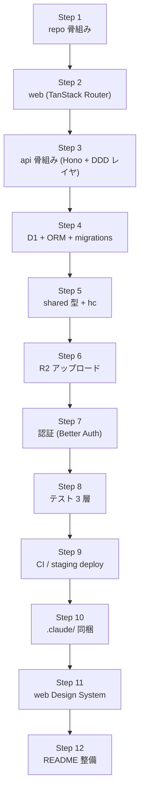

# app-template 実装計画

このテンプレ Repository を実体化するための作業計画。
スタック・コーディング規約・ディレクトリ構成は [README.md](../README.md) を正とする。

---

## ゴール

- clone → `npm install` → `npm run dev` で web / api / D1 ローカルが立ち上がる
- サンプル機能 1 本（items + 画像アップロード）が「画面 → API → D1 → R2」を貫通
- 自動テスト 3 層（unit / API / E2E）が green
- CI（lint / typecheck / test / build / staging deploy）が回る
- `.claude/commands/` から `db-design` などが起動できる

---

## 作業ステップ

各 Step は独立した PR として進める。

### Step 1. repo 骨組み

- `apps/`, `packages/`, `db/`, `.claude/`, `.github/workflows/`, `scripts/` を作成
- monorepo（`npm workspaces` / Turborepo）構成
- `tsconfig.json` ベース（`strict: true`, `noUncheckedIndexedAccess: true`）
- ESLint / Prettier / `.editorconfig` / `.gitignore`
- ESLint ルール:
  - `@typescript-eslint/consistent-type-assertions`（`as` 系を error）
  - `@typescript-eslint/no-non-null-assertion`（`!` を error）
  - Hono ハンドラ内 `as` キャスト禁止

完了基準: `npm install` / `npm run lint` / `npm run typecheck` が green。

### Step 2. apps/web（React + TanStack Router + Vite）

- Vite + React + TanStack Router（file-based）
- TanStack Query / React Hook Form をセットアップ
- **package by feature** + **group routing** 構成（README「apps/web」セクションと同期）
  - `src/routes/__root.tsx`
  - `src/routes/(public)/login.tsx`（未ログイン専用 group）
  - `src/routes/(app)/_layout.tsx`（認可ガード + AppShell）
  - `src/routes/(app)/index.tsx`, `src/routes/(app)/items/index.tsx`
  - `src/features/items/`（components / hooks / api / index.ts の公開境界）
  - `src/shared/`（designSystem / ui / hooks / lib）
- features 同士の直接 import を禁止する ESLint 制約（`no-restricted-imports` で `features/*/!(index)` を弾く）

完了基準: `(public)` / `(app)` の group routing が動き、`/items` が `features/items/` の hook 経由で空配列を表示する。

### Step 3. apps/api 骨組み（Hono + DDD レイヤ）

- `wrangler.toml` 最小構成
- `src/core/` に http / db / errors / logging を用意
- `src/modules/items/` を作成（`domains` / `repositories` / `queries` / `services` / `handlers` / `schemas` / `routes.ts`）
- `/api/items` GET だけ実装（空配列を返す）
- `export type AppType = typeof app`

完了基準: `curl localhost:8787/api/items` が `[]` を返す。レイヤごとのファイルが揃っている。

### Step 4. D1 + ORM + migrations

- ORM（Drizzle 想定）を導入
- `db/schema.ts` に `items`（id, name, image_key, created_at, updated_at）
- `db/migrations/0001_init.sql` を生成
- `npm run db:migrate:local` で `wrangler d1 migrations apply --local`
- `wrangler.toml` に `[[d1_databases]]` binding
- repository に Drizzle で実 CRUD を実装

完了基準: ローカル D1 にマイグレーションが流れ、`/api/items` POST → GET が機能する。

### Step 5. packages/shared と `hc<AppType>`

- `packages/shared/src/schemas.ts` に zod スキーマ
- Hono ルートで `@hono/zod-validator` を必須化（`c.req.valid('json' | 'query' | 'param')`）
- `packages/shared/src/client.ts` で `hc<AppType>(baseURL)` を export
- web は `useQuery({ queryFn: () => client.api.items.$get(...) })` で取得
- フォームは React Hook Form + `zodResolver`

完了基準: フロントで `client.api.items.$get` の戻り値型が schema から導出されている。フォームバリデーションが zod で動く。

### Step 6. R2 アップロード

- `wrangler.toml` に `[[r2_buckets]]` binding
- `POST /api/items/:id/image-upload-url` で署名付き PUT URL
- フロントから直接 R2 に PUT、`image_key` を items に保存
- `GET /api/items/:id/image` で署名付き GET URL

完了基準: 画面から画像をアップロードし、再読込後に表示される。

### Step 7. 認証（Better Auth）

- Better Auth を `apps/api` に組み込み、`users` / `sessions` を `db/schema.ts` に追加、`/api/auth/*` を生やす
- フロントは `hc` クライアント経由でセッションを取得し、`useQuery` で current user を扱う
- 認可済みルートは Hono middleware でセッション検証

完了基準: ログイン → 認可済み API 呼び出しが通る。

### Step 8. テスト戦略（参考実装つき）

**方針**

- backend は **原則 integration test**（API ハンドラ ↔ test DB）を書く。service / repository を個別にモックする unit test は最小限
- test DB は **in-memory SQLite**（`better-sqlite3 :memory:` + Drizzle）を採用し、`vitest-pool-workers` で各テストごとにマイグレーション適用済みの DB を渡す
- 各 Step で実装したサンプル機能には、その層の **参考テストを 1 本必ず添える**（コピー元として残す）

**レイヤ別**

| 層 | パス | 役割 | 参考テストの位置づけ |
| --- | --- | --- | --- |
| Unit（ドメイン） | `apps/api/src/**/*.entity.test.ts` / `packages/shared/**/*.test.ts` | zod スキーマ境界・ドメイン関数の純粋ロジック | 数を増やしすぎない。境界値・状態遷移のみ |
| Integration（API ↔ DB） | `apps/api/test/**/*.test.ts` | Hono ハンドラを `app.request()` で叩き、in-memory DB の状態を検証 | **backend の主戦場**。CRUD / 認可 / エラーパスを網羅 |
| E2E | `apps/web/e2e/**/*.spec.ts` | Playwright で golden path 1 本（画像付き item 作成 → 一覧表示） | 増やすなら critical user journey のみ |

**in-memory test DB の作り方**

- `apps/api/test/helpers/createTestDb.ts`
  - `better-sqlite3(':memory:')` で SQLite を立て、Drizzle の `migrate()` で `db/migrations/` を適用
  - 戻り値は `{ db, dbClient }` のセット
- `beforeEach` で毎回新しい DB を作り、テスト間の汚染をゼロにする
- `app.request('/api/items', { method: 'POST', ... })` のような呼び方で、実 Hono アプリを通す
- R2 / 外部 API は in-process スタブ（`miniflare` の R2 emulation か、自前の Map 実装）を inject

**参考テストとして残すもの**

- Step 4: repository CRUD の integration test（test DB 直叩き）
- Step 5: `/api/items` GET / POST の API integration test（zod バリデーション失敗ケース込み）
- Step 6: `/api/items/:id/image-upload-url` のスタブ R2 を使った integration test
- Step 7: 未ログイン → 401、ログイン後 → 200 の認可 integration test
- Step 2 (web): `features/items/hooks` の Vitest + MSW でのテスト
- E2E: 画像付き item を作って一覧に出る 1 本

**ルール**

- service / query / repository を個別モックする unit test は **どうしても網羅できない条件分岐に限る**
- handler 単独の unit test は書かない（integration で代替）
- `src/__tests__/mocks/` のモック生成関数は外部 SaaS（Stripe / メール送信等）専用にし、DB は本物（in-memory）を使う
- `npm run test:setup` でテスト DB マイグレーションが流れる（CI で都度実行）

完了基準: ローカル / CI で `npm run test` が green。各レイヤに参考テストが残っている。

### Step 9. CI / staging deploy

- `.github/workflows/ci.yml`: `lint / typecheck / test:unit / test:api / test:e2e / build`
- `.github/workflows/deploy-staging.yml`: `main` push で `wrangler deploy`（api）と `wrangler pages deploy`（web）
- Cloudflare API token は GitHub Secrets

完了基準: PR で CI が回り、`main` マージで staging URL が更新される。

### Step 10. .claude/ 同梱

`.claude/commands/` に標準セットをコピー:

- レビュー: `critics-reviewer`, `loop-critics-fix`, `inline-review`, `next-concern`, `fix-critics`, `resolve-concern`
- worktree: `gtr`, `gtr-new`, `worktree-checkout`
- PR: `pr-description`, `update-pr`, `pr-cleanup`, `pr-issue`, `pr-test`, `pr-annotate`, `pr-qa-checklist`
- commit: `commit-jp`, `squash-commits`
- CI: `ci`, `request-ai-review`, `reply-reviews`, `review-comment-analysis`
- 個人: `my-prs`, `my-plan`, `session-summary`

新規コマンドを実装:

- `db-design`: 入力（自然言語の機能要件）→ 出力（テーブル一覧 / Mermaid ER / 型・インデックス案 / migration draft / `db/schema.ts` 追記 diff）
  - 強制ルール: 物理 vs 論理削除を必ず確認 / `created_at` / `updated_at` 必須 / SQLite 制約（FK / Boolean = INTEGER / JSON 扱い）/ 100 行超は分割提案
- `db-migrate`: `wrangler d1 migrations create / apply` のラッパ。local / staging 差分を踏まえた手順生成
- `cf-deploy`: Pages / Workers デプロイ前の env / D1 / R2 binding 整合性チェック

`.claude/CLAUDE.md` に **テンプレ固有のルールのみ** 記述:

- file-based routing でルートを足すルール
- Hono ルート追加時に `packages/shared` の zod スキーマと型を必ず更新
- DDD レイヤの責務（domains / repositories / queries / services / handlers）
- D1 マイグレーションは `db/migrations/` 経由で `wrangler` を通す
- グローバルな汎用ルール（コメント方針等）は個人 `~/.claude/CLAUDE.md` に委ね、ここには重複させない

完了基準: `claude` 起動時に repo ローカルコマンドが認識され、`db-design` が動く。

### Step 11. web Design System

`apps/web/src/shared/designSystem/` を整備（README §「apps/web — Design System」と同期）。

- `tokens/`: colors / spacing / radii / fonts / font-sizes / line-heights / breakpoints / z-index
- `semantic-tokens/`: bg / fg / border / shadow（light / dark で値だけ分岐）
- `recipes/`: button / input / badge
- `slot-recipes/`: card / dialog
- `text-styles.ts`, `layer-styles.ts`, `animation-styles.ts`, `keyframes.ts`, `breakpoints.ts`, `global-css.ts`
- `index.ts` でシステムを組み立てて Provider に渡す

ルール:

- 物理トークンを画面で直接使わない、必ず semantic 経由
- 一度きりの hard-coded 色 / 余白は禁止、増えたら token / recipe に昇格

完了基準: サンプル画面のスタイルがすべて semantic トークン経由になっている。

### Step 12. README 整備

- 「最初の 30 分」: clone → `npm install` → `npm run dev` → トップ表示
- 「次の 1 日」: D1 にマイグレーション、items を増やす、画像をアップロード
- 「本番公開前チェックリスト」: secrets 設定 / Access policy or Better Auth 切替 / R2 公開設定 / カスタムドメイン
- 「乗り換え時のガイド」: D1 → Postgres / R2 → S3 のスケール限界と移行先

完了基準: README だけで初見の開発者が staging URL まで到達できる。

---

## 撤退ライン（README からの再掲）

- D1 のクォータ / レイテンシ要件を超えた → Postgres + S3 互換ストレージへ移行
- Better Auth では賄えない要件（SAML / 既存 IdP 連携必須等）→ Clerk / Auth0 等 SaaS or 既存 IdP

---

## 直近のアクション

1. Step 1（repo 骨組み）の PR
2. 以降 Step 2〜12 を順次 PR 化、`critics-reviewer` を通してマージ
